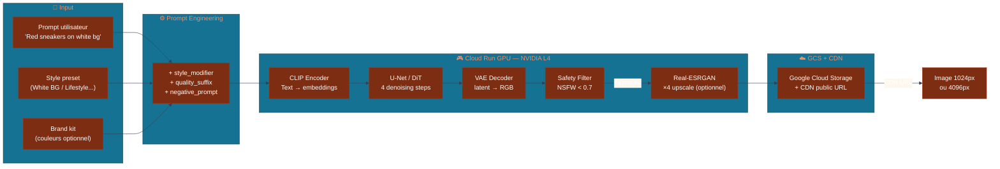
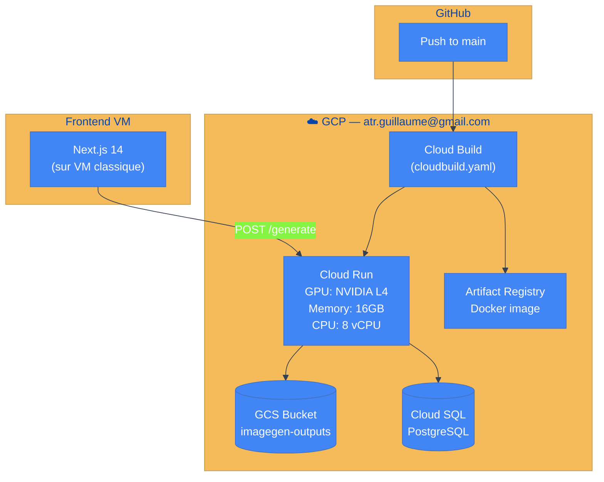
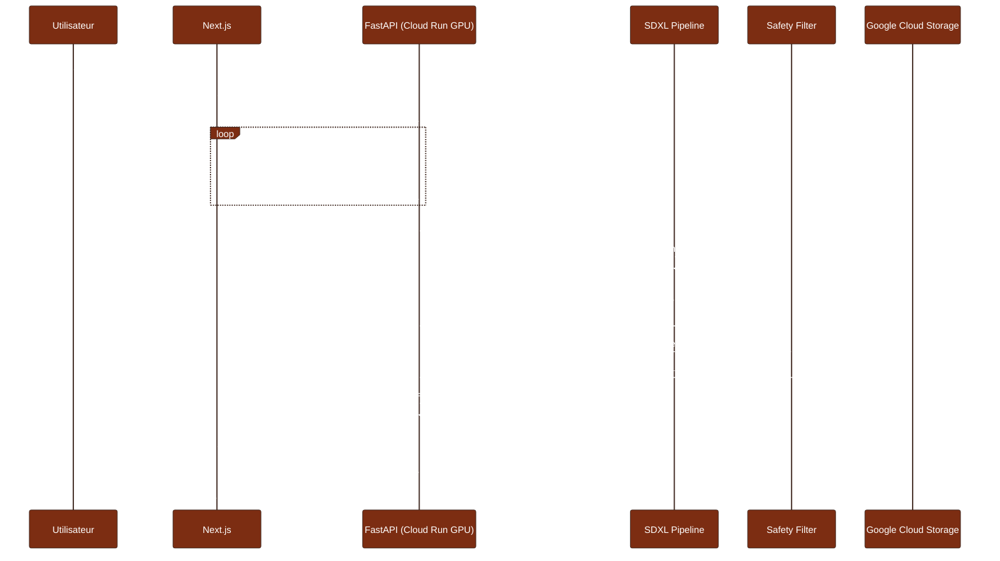
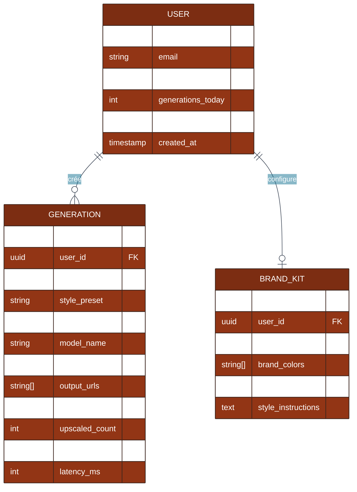

# ImageGen — Génération d'images produit par IA (Stable Diffusion XL / FLUX.1)

> Générez des photos produit professionnelles en 4 secondes. Zéro studio. Infiniment scalable.

[](https://fastapi.tiangolo.com)
[](https://nextjs.org)
[](https://huggingface.co/docs/diffusers)
[](https://cloud.google.com/run)
[](https://cloud.google.com/storage)

---

## Table des matières
1. [Vue d'ensemble](#vue-densemble)
2. [Stack technique](#stack-technique)
3. [Architecture mono-repo](#architecture-mono-repo)
4. [Modèles de diffusion — Concepts techniques](#modèles-de-diffusion)
5. [Diagrammes UML](#diagrammes-uml)
6. [PRD](#prd)
7. [User Stories](#user-stories)
8. [Règles métier](#règles-métier)
9. [Spécification API](#spécification-api)
10. [Simulation UI](#simulation-ui)
11. [Déploiement Cloud Run GPU](#déploiement)
12. [CI/CD](#cicd)
13. [Roadmap](#roadmap)

---

## Vue d'ensemble

ImageGen est un service de génération d'images produit alimenté par Stable Diffusion XL Turbo (SDXL-turbo) ou FLUX.1-schnell. Une requête texte + style preset génère en 4 secondes une image professionnelle 1024×1024, upscalée à 4096×4096 via Real-ESRGAN sur demande. Le service tourne sur Google Cloud Run avec GPU NVIDIA L4 (compte GCP : atr.guillaume@gmail.com).

**Domaine :** E-commerce / Marketing Créatif / Product Photography  
**Infrastructure :** GCP Cloud Run GPU (NVIDIA L4) — atr.guillaume@gmail.com  
**Sous-domaine :** imagegen.wikolabs.com

---

## Modèles de diffusion — Concepts techniques

### Architecture SDXL (Stable Diffusion XL)
SDXL utilise un pipeline **U-Net conditionné** sur des embeddings texte :

```
Prompt → CLIP-L encoder + OpenCLIP-G encoder → Text embeddings
Gaussian noise (latent space 128×128×4) → U-Net denoising (×N steps) → VAE decoder → Image 1024×1024
```

**SDXL-turbo** = distillation en **4 steps** (vs 20–50 pour SDXL base) via Adversarial Diffusion Distillation (ADD).

### Architecture FLUX.1 (Black Forest Labs)
FLUX utilise un **Transformer en flux** (DiT — Diffusion Transformer) avec attention bidirectionnelle :
- Pas de séparation U-Net encoder/decoder
- Meilleure cohérence texte-image (prompt following)
- FLUX.1-schnell = 4 steps, licence Apache 2.0

### Processus de génération
1. **Tokenization** : prompt → tokens CLIP
2. **Text encoding** : tokens → embeddings 768-dim (CLIP-L) + 1280-dim (OpenCLIP-G)
3. **Noise sampling** : z ~ N(0, I) dans le latent space (4× downscaled)
4. **Denoising loop** : U-Net ou DiT prédit le bruit résiduel à chaque step (scheduler DDPM/DPM-Solver++)
5. **VAE decoding** : latent 128×128×4 → image RGB 1024×1024
6. **Upscaling** : Real-ESRGAN ×4 → 4096×4096

### ControlNet (extension)
Injecte un signal de contrôle supplémentaire (Canny edges, OpenPose, depth map) dans le U-Net pour guider la structure spatiale de la génération.

---

## Stack technique

| Couche | Technologie | Rôle |
|--------|------------|------|
| Frontend | Next.js 14, TypeScript, Tailwind CSS | Interface génération, galerie, brand kit |
| Backend | FastAPI (Python 3.11), asyncio | API génération, job management |
| Diffusion | **diffusers 0.29** (HuggingFace), torch 2.3 | SDXL-turbo ou FLUX.1-schnell pipeline |
| Upscaling | **Real-ESRGAN** | 1024→4096 générative super-resolution |
| Safety | **CompVis safety checker** (CLIP-based NSFW) | Filtrage contenu inapproprié |
| Storage | **Google Cloud Storage** (GCS) | Images générées + CDN public |
| Base de données | PostgreSQL 16 | Générations, prompts, users, brand kits |
| Infrastructure | **GCP Cloud Run GPU** (NVIDIA L4, 24GB VRAM) | Inférence GPU |
| CI/CD | GitHub Actions → **Google Cloud Build** → Cloud Run | Deploy automatique |

### backend/requirements.txt
```
fastapi==0.111.0
uvicorn[standard]==0.29.0
diffusers==0.29.2
transformers==4.41.2
accelerate==0.30.1
torch==2.3.0
Pillow==10.3.0
google-cloud-storage==2.17.0
asyncpg==0.29.0
sqlalchemy[asyncio]==2.0.30
pydantic==2.7.1
basicsr==1.4.2
realesrgan==0.3.0
```

---

## Architecture mono-repo

```
imagegen/
├── frontend/
│   ├── src/app/
│   │   ├── page.tsx               # Interface génération principale
│   │   ├── gallery/               # Historique générations utilisateur
│   │   └── brand-kit/             # Configuration brand colors + styles
│   └── src/components/
│       ├── PromptInput.tsx        # Input texte + style selector
│       ├── StylePresets.tsx       # 5 presets visuels
│       ├── GenerationGrid.tsx     # 4 variantes générées
│       ├── UpscaleButton.tsx      # Upscale 1K → 4K
│       └── ExportPanel.tsx        # PNG / JPEG / WebP download
├── backend/
│   ├── app/
│   │   ├── main.py
│   │   ├── routers/
│   │   │   ├── generate.py        # POST /generate (async)
│   │   │   ├── jobs.py            # GET /jobs/{id} (polling)
│   │   │   └── gallery.py         # GET /gallery (user history)
│   │   ├── services/
│   │   │   ├── pipeline.py        # SDXL / FLUX pipeline loader
│   │   │   ├── prompt_engine.py   # Prompt engineering + négative
│   │   │   ├── safety.py          # NSFW classifier
│   │   │   ├── upscaler.py        # Real-ESRGAN ×4
│   │   │   └── storage.py         # GCS upload + CDN URL
│   │   └── models/
│   │       └── generation.py
│   ├── requirements.txt
│   └── Dockerfile                 # FROM nvidia/cuda:12.1.0-runtime-ubuntu22.04
├── cloudbuild.yaml
├── docker-compose.yml             # Dev local (CPU fallback)
└── .github/workflows/deploy.yml
```

---

## Diagrammes UML

### Pipeline de génération



### Architecture Cloud Run



### Séquence — Génération async



### Modèle de données (ER)



---

## PRD

### Problème
Une photo produit e-commerce coûte 50–500€ (studio, photographe, retouche). Un catalogue de 10 000 SKUs = 500k€+ en photography. La mise à jour des visuels (saisons, A/B test) est lente et coûteuse. Les équipes marketing attendent des semaines pour des variantes créatives.

### Solution
API de génération : un prompt texte + style preset → 4 variantes en 4 secondes à < 0.10€/image. Générez des centaines de variantes en quelques minutes pour l'A/B test. Upscalez à 4K pour les catalogues imprimés.

### Utilisateurs cibles
| Persona | Besoin |
|---------|--------|
| E-commerçant | Générer les photos de son catalogue sans studio |
| Designer | Itérer rapidement sur des concepts créatifs |
| Marketing | Produire 50 variantes pour A/B test visuels |

### OKRs
- Génération < 5s par image (GPU L4)
- Qualité FID score < 15 vs photo studio (évaluation perceptuelle)
- Coût cible < 0.10€/image (Cloud Run spot pricing)
- NSFW recall > 99.9% (zéro image inappropriée délivrée)

---

## User Stories

```
US-01 [E-commerçant] En tant qu'e-commerçant,
      je veux uploader une description produit et obtenir 4 photos
      en moins de 10 secondes
      afin de mettre à jour mon catalogue sans photographe.

US-02 [Designer] En tant que designer,
      je veux sélectionner un style preset (White BG / Lifestyle / Studio Dark)
      afin que les images soient cohérentes avec ma charte graphique.

US-03 [Marketing] En tant que marketing manager,
      je veux générer 50 variantes d'une même image avec différents styles
      afin de les A/B tester et identifier le meilleur visuel.

US-04 [Système] En tant que safety filter,
      je veux bloquer automatiquement tout contenu NSFW
      avant de l'uploader sur GCS
      afin de protéger la plateforme et les utilisateurs.

US-05 [Dev] En tant que développeur,
      je veux une API REST avec polling /jobs/{id}
      afin d'intégrer la génération dans notre pipeline e-commerce.
```

---

## Règles métier

| # | Règle | Description | Simulable UI |
|---|-------|-------------|-------------|
| R1 | Prompt engineering auto | + style_modifier + quality_suffix + negative_prompt injectés | ✅ Preview prompt |
| R2 | Safety filter | NSFW score > 0.7 → image rejetée, pas uploadée | ✅ Mock safety |
| R3 | Style presets | 5 presets : White BG, Lifestyle, Studio Dark, Outdoor, Minimalist | ✅ Selector |
| R4 | Batch 4 variantes | Toujours générer 4 variantes, user sélectionne | ✅ Grid affichage |
| R5 | Seed management | Seed sauvegardé → résultat reproductible | ✅ Input seed |
| R6 | Rate limiting | 20 générations/jour plan gratuit, illimité Pro | ✅ Counter |
| R7 | Upscale on demand | ×4 via Real-ESRGAN sur clic | ✅ Bouton upscale |
| R8 | Export formats | PNG (transparence), JPEG (web), WebP | ✅ Format picker |
| R9 | Brand kit | Couleurs brand injectées dans prompt (color conditioning) | ✅ Palette picker |
| R10 | Model selection | SDXL-turbo (rapide) vs FLUX.1-schnell (qualité) | ✅ Toggle model |

### Prompt engineering
```python
def build_prompt(user_prompt: str, style: str, brand_colors: list[str]) -> dict:
    style_modifiers = {
        "white_bg": "product on pure white background, studio lighting, high key",
        "lifestyle": "lifestyle photography, natural light, in use context",
        "studio_dark": "dark studio background, dramatic side lighting, luxury feel",
    }
    quality_suffix = "8k resolution, photorealistic, sharp focus, commercial photography"
    negative = "blurry, low quality, distorted, watermark, text, logo, bad anatomy"
    return {
        "prompt": f"{user_prompt}, {style_modifiers[style]}, {quality_suffix}",
        "negative_prompt": negative,
    }
```

---

## Spécification API

**Base URL :** `https://imagegen.wikolabs.com/api/v1`

### POST /generate
```json
{
  "prompt": "Red leather sneakers, size 42",
  "style_preset": "white_bg",
  "n_images": 4,
  "seed": 42,
  "model": "sdxl-turbo",
  "upscale": false
}
// Response: {"job_id": "job_uuid", "status": "QUEUED", "estimated_seconds": 8}
```

### GET /jobs/{id}
```json
{
  "status": "COMPLETED",
  "output_urls": [
    "https://storage.googleapis.com/imagegen-outputs/gen_uuid_0.jpg",
    "https://storage.googleapis.com/imagegen-outputs/gen_uuid_1.jpg"
  ],
  "latency_ms": 3840,
  "model": "sdxl-turbo",
  "seed": 42
}
```

### POST /jobs/{id}/upscale
Déclenche Real-ESRGAN ×4 sur l'image sélectionnée → retourne URL 4K.

---

## Simulation UI

Mode démo **avec Replicate API** (fallback gratuit) ou images pré-générées embarquées.

| Composant | Description |
|-----------|-------------|
| **Prompt Input** | Textarea avec placeholder "Décrivez votre produit..." |
| **Style Selector** | 5 presets avec aperçu thumbnail |
| **Generation Progress** | Skeleton loader pendant la génération (4–8s) |
| **Image Grid** | 4 images 2×2 avec boutons "Sélectionner" / "Upscale" / "Télécharger" |
| **Prompt Preview** | Affiche le prompt complet après engineering |
| **Brand Kit Editor** | Sélecteur de couleurs → aperçu impact sur prompt |
| **Gallery** | Historique 20 dernières générations avec seeds |

---

## Déploiement Cloud Run GPU

### cloudbuild.yaml
```yaml
steps:
  - name: gcr.io/cloud-builders/docker
    args: [build, -t, gcr.io/$PROJECT_ID/imagegen, ./backend]
  - name: gcr.io/cloud-builders/docker
    args: [push, gcr.io/$PROJECT_ID/imagegen]
  - name: gcr.io/google.com/cloudsdktool/cloud-sdk
    args:
      - gcloud
      - run
      - deploy
      - imagegen
      - --image=gcr.io/$PROJECT_ID/imagegen
      - --region=us-central1
      - --gpu=1
      - --gpu-type=nvidia-l4
      - --memory=16Gi
      - --cpu=8
      - --max-instances=5
      - --concurrency=1
      - --timeout=300s
```

### Dockerfile
```dockerfile
FROM nvidia/cuda:12.1.0-runtime-ubuntu22.04
RUN pip install torch==2.3.0 --index-url https://download.pytorch.org/whl/cu121
COPY backend/requirements.txt .
RUN pip install -r requirements.txt
# Pre-download SDXL weights au build time (bake dans l'image)
RUN python -c "from diffusers import AutoPipelineForText2Image; AutoPipelineForText2Image.from_pretrained('stabilityai/sdxl-turbo', torch_dtype=torch.float16)"
```

---

## CI/CD

```yaml
name: Deploy ImageGen to Cloud Run
on:
  push:
    branches: [main]
jobs:
  deploy:
    runs-on: ubuntu-latest
    steps:
      - uses: actions/checkout@v4
      - uses: google-github-actions/auth@v2
        with:
          credentials_json: ${{ secrets.GCP_SA_KEY }}
      - uses: google-github-actions/setup-gcloud@v2
      - run: gcloud builds submit --config cloudbuild.yaml
```

---

## Roadmap

### Phase 1 — MVP (Semaines 1–4)
- [ ] Pipeline SDXL-turbo sur Cloud Run GPU L4
- [ ] 5 style presets + prompt engineering
- [ ] Safety filter NSFW
- [ ] API async polling + GCS storage
- [ ] UI génération + grid 4 variantes

### Phase 2 — Qualité (Semaines 5–8)
- [ ] FLUX.1-schnell comme alternative model
- [ ] Real-ESRGAN ×4 upscale on demand
- [ ] Brand kit (color conditioning)
- [ ] Export PNG transparent (product cutout)

### Phase 3 — Avancé (Semaines 9–12)
- [ ] ControlNet (edge conditioning depuis photo existante)
- [ ] Fine-tuning DreamBooth sur produits spécifiques d'un client
- [ ] Batch generation (100 SKUs en 1 appel)
- [ ] A/B test visuals integration (Shopify app)

---

*Un produit [Wikolabs](https://wikolabs.com) — Intelligence artificielle appliquée aux métiers*
